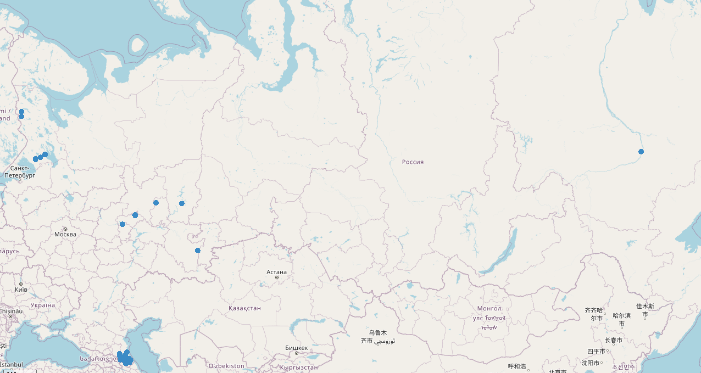
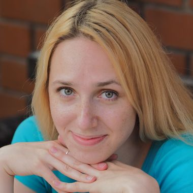

```{r, include=FALSE}
knitr::opts_chunk$set(echo = FALSE, warning = FALSE, message = FALSE, dev='cairo_pdf', fig.align='center', fig.show='hold', out.width='99%')
# setwd("/home/agricolamz/work/materials/2023.10.28_RSUH_variability")
library(tidyverse)
library(treemapify)
theme_set(theme_minimal()+theme(text = element_text(size = 16), legend.position = "bottom"))
```

#  Ресурсы международной лаборатории языковой конвергенции

## Ресурсы международной лаборатории языковой конвергенции

- lingconlab.ru
- 22 устных диалектных корпуса
- 8 устных билингавльных корпусов
- 10 корпусов малых языков
- другие
    - словари (мегебский, рутульский, тукитинский, хваршинский, даргинский)
    - Типологический атлас языков Дагестана
    - Атлас многоязычия в Дагестане
    - Атлас рутульских диалектов
    - Корпус Просодии Русских Диалектов (ПРуД)
    - ...

## 22 устных диалектных корпуса

```{r}
resources <- read_tsv("/home/agricolamz/work/bureaucracy/linguistic_convergency/LABsite/data/corpora_villages.tsv")
resources |> 
  filter(subtype == "dialectal",
         name_ru != "Корпус просодии русских диалектов") |> 
  distinct(name_ru, n_tokens) |> 
  mutate(n_tokens = str_remove(n_tokens, "&nbsp;"),
         n_tokens = str_remove(n_tokens, "~"),
         n_tokens = as.double(n_tokens),
         name_ru = str_c(name_ru, "\n", formatC(n_tokens, format="f", big.mark=",", digits=0), " ток.")) |> 
  arrange(-n_tokens) |> 
  ggplot(aes(area = n_tokens, label = name_ru))+
  geom_treemap(fill = "white", color = "black", size = 5) +
  geom_treemap_text()
```

## 22 устных диалектных корпуса

```{r, out.width='71%'}
knitr::include_graphics("images/01_dialects.png")
```
  
```{r, eval=FALSE}
resources |> 
  filter(subtype == "dialectal",
         name_ru != "Корпус просодии русских диалектов") ->
  d

library(leaflet)
leaflet(sf::st_read("data/dialects.json")) |>
  addTiles() |> 
  addPolygons(stroke = FALSE, smoothFactor = 0.3, fillOpacity = 0.5,
              fillColor = ~color) |> 
  addCircleMarkers(
    lng = d$lon,
    lat = d$lat,
    radius = 3,
    opacity = 1,
    fillOpacity = 1,
    popupOptions = leaflet::popupOptions(maxWidth = 700),
    labelOptions = leaflet::labelOptions(
        noHide = FALSE,
        textOnly = TRUE,
        direction = "center")) 
```


## 8 устных билингавльных корпусов

```{r}
resources |> 
  filter(subtype == "bilingual") |> 
  distinct(name_ru, n_tokens) |> 
  mutate(n_tokens = str_remove(n_tokens, "&nbsp;"),
         n_tokens = str_remove(n_tokens, "~"),
         n_tokens = as.double(n_tokens),
         name_ru = str_c(name_ru, "\n", formatC(n_tokens, format="f", big.mark=",", digits=0), " ток.")) |> 
  arrange(-n_tokens) |> 
  ggplot(aes(area = n_tokens, label = name_ru))+
  geom_treemap(fill = "white", color = "black", size = 5) +
  geom_treemap_text()
```

## 8 устных билингавльных корпусов

```{r}

```

```{r, eval=FALSE}
resources |> 
  filter(subtype == "bilingual") |> 
  select(lat, lon) ->
  b
library(lingtypology)
map.feature(languages = "Russian",
            latitude = b$lat,
            longitude = b$lon)
```

## 10 корпусов малых языков

```{r}
resources |> 
  filter(subtype == "minority",
         name_ru != "База данных примеров андийских словарей") |> 
  distinct(name_ru, n_tokens) |> 
  mutate(n_tokens = str_remove(n_tokens, "&nbsp;"),
         n_tokens = str_remove(n_tokens, "~"),
         n_tokens = as.double(n_tokens),
         name_ru = str_c(name_ru, "\n", formatC(n_tokens, format="f", big.mark=",", digits=0), " ток.")) |> 
  arrange(-n_tokens) |> 
  ggplot(aes(area = n_tokens, label = name_ru))+
  geom_treemap(fill = "white", color = "black", size = 5) +
  geom_treemap_text()
```

## 10 корпусов малых языков

```{r}
knitr::include_graphics("images/03_minority.png")
```

```{r, eval=FALSE}
resources |> 
    filter(subtype == "minority",
         name_ru != "База данных примеров андийских словарей") |> 
  select(lat, lon, lang) ->
  m

library(lingtypology)
map.feature(languages = "Russian",
            latitude = b$lat,
            longitude = b$lon)
```


## {}

\LARGE Что делать со всеми этими корпусами?

## Cкорость речи [@moroz23: 382]

```{r, out.width='80%'}
knitr::include_graphics("images/04_speech_rate.png")
```

## [Корпус просодии русских диалектов](https://lingconlab.github.io/PRuD/) [@knyazev24]

```{r}

```

## Проект Dial2

```{r, out.width="29%", fig.cap="М. В. Ермолова, С. С. Земичева, Н. А. Кошелюк", fig.show='hold'}


```

```{r, out.width="29%", fig.cap="Г. А. Мороз, К. Наккарато, А. В. Яковлева", fig.show='hold'}

knitr::include_graphics("images/chiara.jpg")

```

## Проект Dial2

- фокус на данных русского языка в диалектных и билингвальных корпусах
- документация и моделирование вариативности в нестандартных вариантах русского языка

# Нестандартные количественные конструкции в речи билингвов

## Почему мы ожидаем вариативность в числительных?

- система русских числительных сложная
- системы числительных в L1 доступных нам корпусах значительно проще
- количественные конструкции в речи билингвов исследовалась в работах [@stoynova19; @stoynova21]
- В работе [@stoynova21] употребление нестанадартных конструкций объясняется контактом
\pause
- Увидим ли мы такой же эффект на основе данных наших корпусов?

## Данные

- Сначала мы отобрали **7,376** контекстов
- Мы исключили:
    - конструкции с порядковыми числительными (*в шестьдесят первом году*)
    - исключили неядерные падежи (*с двумя детьми*)
    - конструкции в которых есть неизменяемые существительные (*два медресе*)
    - конструкции без выраженного имени (*восемь было*)
    - конструкции с числительным *один* и существительными, которые имеют свойства имени (*тысяча*, *миллион*, и др.)
    - примеры, где нет социолингвистической информации о носителе
- Осталось: **4,196** примеров:

(@) *Пешком ходил Верхний Дженгутай пять километра.* (Корпус дагестанского русского)

(@) *Этот меньше, после двое аборт делала одну.* (Корпус марийских билингвов)

## Носители

```{r}

```

## Структура данных

```{r}

```

## Только 52 из 189 носителей исользуют нестандартные конструкции (28%)

```{r}

```

## Только 52 из 189 носителей исользуют нестандартные конструкции (28%)

```{r}

```

## Процент конструкций, если оставить только носителей, которые используют нестанадртные формы

```{r, out.width='80%'}

```

## Можно ли объяснить наблюдаемую вариативность контактом?

```{r}

```

\pause

- Нет
    - Если бы наблюдаемое было просто калькирование, то мы бы ожидали больше случаев совпадения ожидаемой конструкции из L1, а такое происходит лишь в половине случаев.

## Логистическая регрессия со случайными эффектами

P(non-st. form) ~ type + (1|corpus/speaker) 

```{r, out.width='78%'}

```

## Логистическая регрессия со случайными эффектами

P(non-st. form) ~ age + education + (1|corpus/speaker) 

```{r, out.width='78%'}

```

## Выводы

- Конструкции с числительными иллюстрируют значительную вариативность в билингвальных корпусах, однако уровень вариативности разный в разных корпусах (самый большой в Дагестане 11%), но все же мы отмечаем меньший процент чем у носителей нанайского и ульчского (25.3%, [@stoynova21: 316])
- Наблюдаемые конструкции лишь в половине случае объяснимы калькированием из L1

# Выпадение предлогов в речи билингвов

## Теоретический контекст

Выпадение предлогов наблюдается и в других языках, например, в новогреческом, аглийском и в разных нестанадртных вариантах русского

## Больше чем корпусное исследование

- При исследовании выпадения предлогов, мы не можем полагаться на разметчиков, так как корпуса размечались по нормам литературного языка.
- В связи с этим, мы вынуждены были переслушивать все контексты, которые нас интересовали.

## Структура данных (4393 наблюдения)

```{r}

```

## Носители

```{r}

```

## Носители, у которых наблюдается выпадение

```{r}

```

## Логистическая регрессия со случайными эффектами

preposition drop ~ corpus * preposition + (1|speaker)

```{r}

```

## Может быть фонология играет какую-то роль?

```{r}

```

## Может быть фонология играет какую-то роль?

```{r}

```

## Может быть фонология играет какую-то роль?

```{r}

```

## В каком корпусе больше всего выпадений?

```{r}

```

## В каком корпусе больше всего выпадений?

```{r}

```

## Анализ согласия

- каждый раз мы делаем вывод на основе прослушивания
- в какой-то момент мы решили проанализировать, а насколько одинаково мы принимаем решения
- потом мы сделали выборку в 200 примеров
- раздали 23 аннотаторам
- унифицировали разметку: бинарное (v-drop, v, NA)
- посчитали расстояния Жаккара и построили иерархическую кластеризацию и нейборнет

## Анализ согласия

```{r}

```

## Анализ согласия

```{r}

```

## Выводы

- Носители из билингвальных корпусов демонстрируют больше выпадения предлогов; 
- К сожалению, данных для моделирования возраста и образования недостаточно;
- Фонетика следующего слова может влиять на выпадение предлогов
- Иногда выпадения предлогов можно объяснить лексикализацией (*в общем*)

## {}

\LARGE Спасибо за внимание!

# Литература {.allowframebreaks}